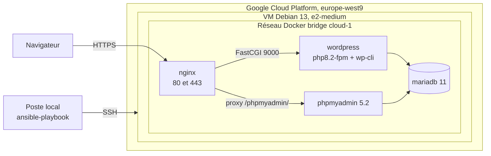
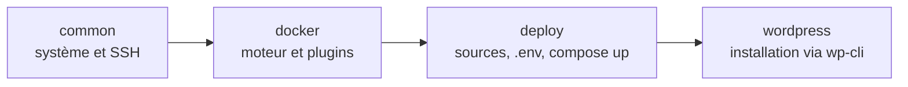

<div align="center">

# Cloud-1

**Déploiement automatisé d'une stack WordPress dockerisée sur une machine virtuelle Google Cloud, provisionnée et orchestrée de bout en bout avec Ansible.**


</div>

## Sommaire

1. [À propos](#à-propos)
2. [Architecture](#architecture)
3. [Stack technique](#stack-technique)
4. [Arborescence du dépôt](#arborescence-du-dépôt)
5. [Prérequis](#prérequis)
6. [Provisionnement de l'infrastructure GCP](#provisionnement-de-linfrastructure-gcp)
7. [Configuration d'Ansible](#configuration-dansible)
8. [Déploiement](#déploiement)
9. [Accès aux services](#accès-aux-services)
10. [Détail des rôles Ansible](#détail-des-rôles-ansible)
11. [Détail des services Docker](#détail-des-services-docker)
12. [Sécurité](#sécurité)
13. [Exploitation courante](#exploitation-courante)
14. [Limitations connues](#limitations-connues)
15. [Auteurs](#auteurs)

## À propos

Cloud-1 automatise l'intégralité du cycle de vie d'un site WordPress hébergé dans le cloud : préparation du système, installation du moteur Docker, synchronisation des sources, rendu des secrets, démarrage de la stack et installation du CMS lui-même.

Une seule commande suffit pour passer d'une VM Debian vierge à un site WordPress fonctionnel, servi en HTTPS, adossé à une base MariaDB persistante et administrable via phpMyAdmin.

Les principes retenus :

- **Idempotence** : le playbook peut être rejoué autant de fois que nécessaire sans effet de bord.
- **Séparation des responsabilités** : quatre rôles Ansible aux périmètres distincts, une image Docker par service.
- **Aucun secret en clair** : mots de passe et clés publiques sont stockés dans un fichier Ansible Vault chiffré en AES256.
- **Persistance des données** : les volumes MariaDB et WordPress sont montés sur le disque de la VM, la stack peut être détruite et reconstruite sans perte.

> Projet réalisé dans le cadre du cursus de l'École 42.

## Architecture



Le port 80 ne sert qu'à rediriger le trafic vers le port 443. NGINX est le seul conteneur exposé sur l'hôte : WordPress, phpMyAdmin et MariaDB restent isolés dans le réseau bridge interne.

Enchaînement des rôles au sein du playbook :



## Stack technique

| Couche | Technologie | Rôle |
| :--- | :--- | :--- |
| Cloud | Google Compute Engine | VM Debian 13 Trixie, type `e2-medium`, IP statique réservée |
| Orchestration | Ansible | Provisionnement idempotent, gestion des secrets, déploiement |
| Conteneurisation | Docker Engine et Compose v2 | Cycle de vie des quatre services |
| Reverse proxy | NGINX stable alpine | Terminaison TLS 1.2 et 1.3, redirection HTTP vers HTTPS, passerelle FastCGI |
| Application | WordPress php8.2-fpm | CMS, avec WP-CLI embarqué dans l'image |
| Base de données | MariaDB 11 | Stockage persistant, healthcheck natif |
| Administration | phpMyAdmin 5.2 | Interface web de la base, exposée sous `/phpmyadmin/` |

## Arborescence du dépôt

```
.
├── ansible
│   ├── inventory
│   │   ├── group_vars/gcp
│   │   │   ├── vars.yml          # variables du groupe, référencent le vault
│   │   │   └── vault.yml         # secrets chiffrés (AES256)
│   │   └── hosts.ini             # inventaire statique du groupe gcp
│   ├── roles
│   │   ├── common                # paquets de base et durcissement SSH
│   │   ├── docker                # dépôt officiel, moteur, plugins, SDK Python
│   │   ├── deploy                # synchronisation des sources, .env, compose up
│   │   └── wordpress             # installation du CMS via WP-CLI
│   ├── requirements.yml          # collections Galaxy requises
│   └── site.yml                  # playbook principal
├── services
│   ├── mariadb
│   │   ├── config/my.cnf
│   │   └── Dockerfile
│   ├── nginx
│   │   ├── config/default.conf
│   │   └── Dockerfile
│   └── wordpress
│       └── Dockerfile
├── ansible.cfg
├── docker-compose.yml
└── README.md
```

## Prérequis

Sur le poste de contrôle :

| Outil | Version conseillée | Vérification |
| :--- | :--- | :--- |
| Ansible | 2.15 ou supérieur | `ansible --version` |
| Google Cloud CLI | à jour | `gcloud version` |
| rsync | fournie par la distribution | `rsync --version` |
| Clé SSH GCP | générée par `gcloud compute ssh` | `ls ~/.ssh/google_compute_engine` |

Côté fournisseur : un compte Google Cloud avec un projet actif et la facturation configurée.

## Provisionnement de l'infrastructure GCP

### 1. Authentification et sélection du projet

```bash
gcloud init
gcloud auth login
gcloud auth list

gcloud config set account '<VOTRE_COMPTE>'
gcloud projects list
gcloud config set project '<ID_PROJET>'
gcloud config get-value project
```

### 2. Garde-fou budgétaire

Un budget avec alertes évite toute dérive de facturation.

```bash
gcloud billing accounts list

gcloud billing budgets create \
  --billing-account='<ID_FACTURATION>' \
  --display-name="Budget Cloud-1" \
  --budget-amount=263EUR \
  --filter-projects=projects/cloud-1 \
  --threshold-rule=percent=0.1 \
  --threshold-rule=percent=0.3 \
  --threshold-rule=percent=0.5 \
  --threshold-rule=percent=0.9

gcloud billing budgets list --billing-account='<ID_FACTURATION>'
```

Suppression du budget le cas échéant :

```bash
gcloud billing budgets delete '<NOM_BUDGET>' --billing-account='<ID_FACTURATION>'
```

### 3. Adresse IP statique

Réserver l'adresse en amont garantit que l'URL du site survit à une recréation de l'instance.

```bash
gcloud compute addresses create cloud-1-ip --region=europe-west9

gcloud compute addresses describe cloud-1-ip \
  --region=europe-west9 \
  --format="get(address)"
```

### 4. Instance et règles de pare-feu

```bash
gcloud compute instances create cloud-1-instance \
  --address='<IP_STATIQUE>' \
  --tags="cloud-1-web" \
  --image=debian-13-trixie-v20260714 \
  --image-project=debian-cloud \
  --zone=europe-west9-b \
  --machine-type=e2-medium

gcloud compute firewall-rules create allow-http-https-ssh \
  --target-tags=cloud-1-web \
  --action=allow \
  --rules=tcp:80,tcp:443,tcp:22
```

Première connexion, qui génère aussi la paire de clés `~/.ssh/google_compute_engine` :

```bash
gcloud compute ssh --project='<ID_PROJET>' --zone=europe-west9-b cloud-1-instance
```

## Configuration d'Ansible

### Fichier `ansible.cfg`

Le fichier de configuration à la racine évite d'avoir à passer les options à chaque appel :

| Clé | Valeur | Effet |
| :--- | :--- | :--- |
| `inventory` | `ansible/inventory/hosts.ini` | plus besoin de l'option `-i` |
| `roles_path` | `ansible/roles` | résolution des rôles |
| `vault_password_file` | `.vault_pass` | déchiffrement automatique du vault |
| `pipelining` | `True` | une seule connexion SSH par tâche, exécution plus rapide |

### Inventaire

Renseigner l'adresse IP de l'instance et le compte utilisateur dans `ansible/inventory/hosts.ini` :

```ini
[gcp]
cloud-1-instance ansible_host=<IP_STATIQUE>

[gcp:vars]
ansible_user=<UTILISATEUR_GCP>
ansible_ssh_private_key_file=~/.ssh/google_compute_engine
```

### Secrets

Créer le fichier contenant le mot de passe du vault, jamais versionné :

```bash
echo '<MOT_DE_PASSE_VAULT>' > .vault_pass
chmod 600 .vault_pass
```

Puis éditer le vault :

```bash
ansible-vault edit ansible/inventory/group_vars/gcp/vault.yml
```

Variables attendues :

```yaml
vault_mysql_root_password: "..."
vault_mysql_database:      "..."
vault_mysql_user:          "..."
vault_mysql_password:      "..."

vault_wp_admin_user:      "..."
vault_wp_admin_password:  "..."
vault_wp_admin_email:     "..."
vault_wp_admin2_user:     "..."
vault_wp_admin2_password: "..."
vault_wp_admin2_email:    "..."

vault_ssh_key_<membre_1>: "ssh-ed25519 AAAA..."
vault_ssh_key_<membre_2>: "ssh-ed25519 AAAA..."
```

Le fichier `vars.yml` ne contient que des références vers ces valeurs, il reste donc lisible en clair dans le dépôt. Les variables non sensibles y sont également définies : `project_dest`, `domain_name`, `wp_title` et `wp_url`.

## Déploiement

```bash
# Installation des collections Galaxy requises
ansible-galaxy collection install -r ansible/requirements.yml

# Vérification de la connectivité
ansible gcp -m ping

# Déploiement complet
ansible-playbook ansible/site.yml
```

Chaque rôle porte un tag, ce qui permet de rejouer une portion précise du playbook :

```bash
# Reconstruire et relancer uniquement la stack Docker
ansible-playbook ansible/site.yml --tags deploy

# Rejouer uniquement l'installation WordPress
ansible-playbook ansible/site.yml --tags wordpress

# Tout sauf la préparation système
ansible-playbook ansible/site.yml --skip-tags common
```

Options utiles pendant la mise au point :

```bash
ansible-playbook ansible/site.yml --check --diff   # simulation
ansible-playbook ansible/site.yml -vvv             # sortie détaillée
```

## Accès aux services

| Service | URL | Identifiants |
| :--- | :--- | :--- |
| Site WordPress | `https://<IP_STATIQUE>/` | sans objet |
| Administration WordPress | `https://<IP_STATIQUE>/wp-admin` | `vault_wp_admin_user` |
| phpMyAdmin | `https://<IP_STATIQUE>/phpmyadmin/` | `vault_mysql_user` |

Le certificat étant auto-signé, le navigateur affiche un avertissement lors du premier accès.

## Détail des rôles Ansible

### `common`

Prépare le système et sécurise l'accès distant.

- Mise à jour du cache APT et installation de `ca-certificates`, `curl`, `gnupg` et `rsync`.
- Dépose un fichier `sshd_config.d/00-cloud-1-root-login.conf` positionnant `PermitRootLogin prohibit-password`, validé par `sshd -t` avant application.
- Ajoute les clés publiques listées dans `root_authorized_keys` aux `authorized_keys` de root.
- Un handler redémarre `sshd` uniquement si la configuration a changé.

### `docker`

Installe le moteur Docker depuis le dépôt officiel plutôt que depuis les paquets Debian.

- Création de `/etc/apt/keyrings` et récupération de la clé GPG officielle.
- Ajout du dépôt upstream, avec architecture et nom de version déduits des faits Ansible.
- Installation de `docker-ce`, `docker-ce-cli`, `containerd.io`, `docker-buildx-plugin` et `docker-compose-plugin`.
- Installation de `python3-docker`, indispensable aux modules de la collection `community.docker`.
- Activation du service au démarrage et ajout de l'utilisateur de déploiement au groupe `docker`.

### `deploy`

Transfère le projet et démarre la stack.

- Création de `/opt/cloud-1` et des répertoires de volumes `volumes/wordpress` et `volumes/mariadb`.
- Synchronisation rsync des sources, en excluant `.git`, `ansible/`, `.env`, `.vault_pass` et `ansible.cfg`. Les options `--no-perms`, `--no-owner`, `--no-group` et `--omit-dir-times` évitent les faux positifs de changement d'un run à l'autre.
- Rendu du template `env.j2` vers `/opt/cloud-1/.env` en mode `0600` : c'est le seul endroit où les secrets atterrissent sur la VM.
- Démarrage via `community.docker.docker_compose_v2`, avec reconstruction des images selon la politique du compose et suppression des conteneurs orphelins.

### `wordpress`

Installe le CMS une fois la stack en ligne, sans jamais passer par l'assistant web.

- Attend la génération de `wp-config.php` par l'image officielle, puis attend que MariaDB accepte les connexions via son script `healthcheck.sh`.
- Teste `wp core is-installed` : toutes les tâches suivantes sont conditionnées par ce résultat, ce qui rend le rôle idempotent.
- Installe le cœur WordPress avec WP-CLI, sans envoi de courriel.
- Définit `WP_HOME` et `WP_SITEURL` comme constantes dynamiques calculées à partir de `$_SERVER["HTTP_HOST"]`, ce qui évite de figer l'IP en base de données.
- Crée un second compte administrateur.

## Détail des services Docker

| Service | Image de base | Exposition | Volume | Particularités |
| :--- | :--- | :--- | :--- | :--- |
| `nginx` | `nginx:stable-alpine` | 80 et 443 sur l'hôte | `wordpress-volume` | Certificat auto-signé généré au build, redirection 301 vers HTTPS |
| `wordpress` | `wordpress:php8.2-fpm` | 9000, réseau interne | `wordpress-volume` | WP-CLI installé dans l'image, `HOME=/tmp` pour l'utilisateur `www-data` |
| `mariadb` | `mariadb:11` | 3306, réseau interne | `database-volume` | Healthcheck `--connect --innodb_initialized` toutes les 10 secondes |
| `phpmyadmin` | `phpmyadmin:5.2` | 80, réseau interne | sans objet | `PMA_ABSOLUTE_URI` aligné sur le sous-chemin `/phpmyadmin/` |

Les deux volumes sont des montages `bind` vers `/opt/cloud-1/volumes/`, ce qui rend les données inspectables directement depuis l'hôte et indépendantes du cycle de vie des conteneurs.

Le démarrage est ordonné par les dépendances : `wordpress` attend que MariaDB soit déclarée saine, `nginx` attend `wordpress`.

## Sécurité

| Mesure | Mise en œuvre |
| :--- | :--- |
| Secrets chiffrés | Ansible Vault AES256, mot de passe hors dépôt via `.vault_pass` |
| Fichiers ignorés | `.env` et `.vault_pass` listés dans `.gitignore` |
| Permissions | `.env` distant en `0600`, propriété root |
| Accès SSH | `PermitRootLogin prohibit-password`, authentification par clé publique uniquement |
| Surface réseau | Pare-feu GCP limité aux ports 22, 80 et 443, un seul conteneur publié |
| Chiffrement | TLS 1.2 et 1.3 exclusivement, HTTP redirigé en 301 vers HTTPS |
| Isolation | Base de données et phpMyAdmin joignables uniquement depuis le réseau bridge interne |

## Exploitation courante

Connexion à la VM :

```bash
ssh <UTILISATEUR_GCP>@<IP_STATIQUE>
cd /opt/cloud-1
```

Commandes utiles :

```bash
docker compose ps                    # état des services
docker compose logs -f nginx         # suivi des journaux
docker compose restart wordpress     # redémarrage ciblé
docker compose down                  # arrêt, les volumes sont conservés
docker compose up -d --build         # reconstruction et redémarrage
```

Administration WordPress en ligne de commande :

```bash
docker exec -u www-data wordpress wp option get siteurl --path=/var/www/html
docker exec -u www-data wordpress wp plugin list --path=/var/www/html
docker exec -u www-data wordpress wp user list --path=/var/www/html
```

Sauvegarde de la base :

```bash
docker exec mariadb mariadb-dump -u root -p"$MYSQL_ROOT_PASSWORD" "$MYSQL_DATABASE" \
  > backup_$(date +%F).sql
```

Repartir d'une base propre, opération destructrice :

```bash
docker compose down
sudo rm -rf /opt/cloud-1/volumes/mariadb/* /opt/cloud-1/volumes/wordpress/*
ansible-playbook ansible/site.yml --tags deploy,wordpress
```

## Limitations connues

- **Certificat auto-signé** : généré au moment du build de l'image NGINX pour le nom `localhost`. Un passage à Let's Encrypt suppose un nom de domaine réel pointant vers l'IP statique.
- **Pas de sauvegarde automatisée** : le dump de la base reste une opération manuelle.
- **Inventaire statique** : l'IP est écrite en dur dans `hosts.ini`. Le plugin d'inventaire dynamique `google.cloud.gcp_compute` supprimerait cette étape manuelle.
- **Instance unique** : aucune redondance ni répartition de charge, l'architecture cible un site de taille modeste.
